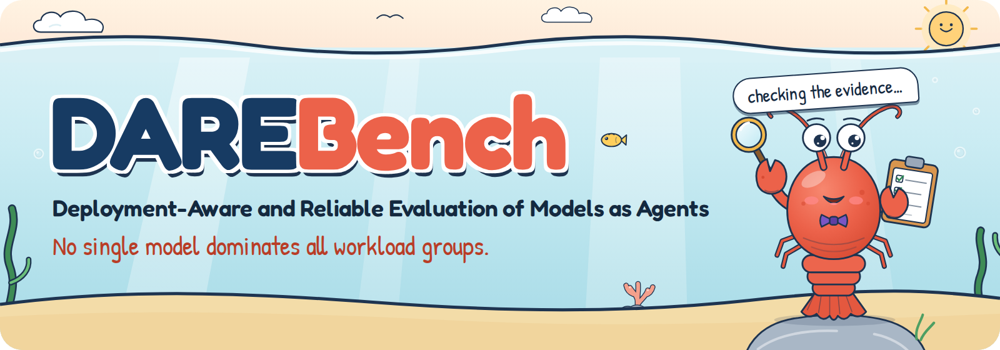
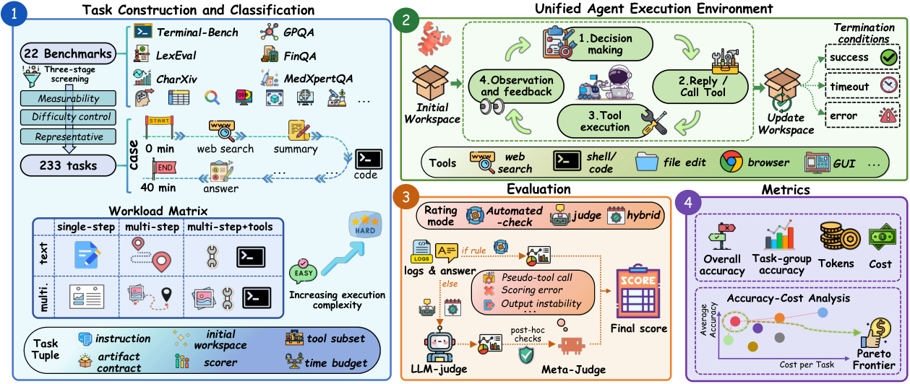

<p align="center">
  
</p>

<h1 align="center">DAREBench: Deployment-Aware and Reliable Evaluation of Models as Agents</h1>

<p align="center">
  <a href="https://arxiv.org/abs/2609.06059"></a>
  <a href="https://seerray-lab.github.io/DareBench/"></a>
  <a href="https://seerray-lab.github.io/DareBench/#leaderboard"></a>
  <a href="https://github.com/SeerRay-Lab/DareBench"></a>
  <a href="https://huggingface.co/datasets/SeerRay-Lab/DAREBench"></a>
  <a href="#citation"></a>
</p>

<p align="center"><b>One shared OpenClaw runtime. A 2&times;3 workload matrix. Evidence-based score auditing.</b></p>

<p align="center"><a href="#overview">Overview</a> &middot; <a href="#leaderboard">Leaderboard</a> &middot; <a href="#quick-start">Quick Start</a> &middot; <a href="#citation">Citation</a></p>

## News

- **5 Sep 2026** &mdash; The DAREBench paper is on [arXiv](https://arxiv.org/abs/2609.06059).
- The [project page](https://seerray-lab.github.io/DareBench/) is live, with an interactive leaderboard, the accuracy&ndash;cost frontiers and the evidence-based audit.

## Overview

DAREBench (Deployment-Aware and Reliable Evaluation of Models as Agents) is a benchmark for evaluating models as agents.
Built on a shared OpenClaw execution environment, it organizes **233 tasks** selected and adapted from
**22 source benchmarks** into a **2&times;3 workload matrix** defined by input modality and execution form, and
evaluates them under a unified contract-based protocol with evidence-based score auditing. The paper evaluates
23 commercial API models and 12 locally deployed open-weight models over
7,587 model&ndash;task runs, reporting accuracy and token consumption alongside reference costs for API models.

<p align="center">
  <a href="docs/assets/img/overview.png"></a>
</p>

*Overview of DAREBench (paper Fig. 2): (1) constructing 233 tasks from 22 source benchmarks and organizing
them by modality and execution form; (2) executing all models in a shared agent environment; (3) applying automated,
LLM-based, or hybrid scoring with evidence-based auditing; and (4) reporting overall and workload-level accuracy,
token usage, reference cost, and accuracy&ndash;cost frontiers.*

### Workload matrix

| | Single-step | Multi-step | Multi-step + tools |
| --- | --- | --- | --- |
| **Text** | **20 tasks**<br>LogiQA · GPQA | **87 tasks**<br>AdvancedIF · Bamboogle · SimpleQA · LongBench · LexEval · TableBench · FinQA | **55 tasks**<br>DeepSearchQA · WideSearch · Seal0 · TerminalBench2 · OpenAgentSafety · OSWorld |
| **Multimodal** | **20 tasks**<br>SimpleVQA · HLE | **26 tasks**<br>CharXiv · MedXpertQA | **25 tasks**<br>AgentVista · MMSearch · MMSearchPlus |

Scoring: 125 automated, 73 LLM-judged and 35 hybrid tasks.

## Leaderboard

Audited accuracy (%) from paper Table 1 (first 10 API models in the paper's order, plus the strongest local model).
The [interactive leaderboard](https://seerray-lab.github.io/DareBench/#leaderboard) covers all 35 models, with API/local filters and sorting.

| Model | Text-SS | Text-MS | Text-MT | Text Avg | MM-SS | MM-MS | MM-MT | MM Avg |
| --- | ---: | ---: | ---: | ---: | ---: | ---: | ---: | ---: |
| Claude-Opus-4.8 | 98.8 | 78.1 | 65.3 | 76.3 | 85.0 | 69.2 | 61.8 | 71.1 |
| GPT-5.5 | 94.1 | 83.6 | 59.8 | 76.8 | 90.0 | 75.0 | 42.4 | 67.7 |
| Claude-Opus-4.6 | 91.5 | 83.4 | 58.3 | 75.9 | 75.0 | 76.2 | 48.1 | 65.9 |
| Gemini-3.1-Pro | 96.4 | 80.7 | 56.1 | 74.3 | 85.0 | 88.5 | 32.7 | 67.9 |
| GPT-5.4 | 92.1 | 82.4 | 59.6 | 75.8 | 82.5 | 71.2 | 40.3 | 63.5 |
| MiMo-V2.5 | 94.7 | 82.5 | 57.5 | 75.5 | 80.0 | 66.7 | 43.0 | 62.1 |
| Claude-Sonnet-4.6 | 89.2 | 76.8 | 59.9 | 72.6 | 75.0 | 59.6 | 42.3 | 57.9 |
| Qwen3.6-Plus | 95.5 | 77.7 | 54.8 | 72.1 | 75.0 | 61.5 | 41.2 | 58.2 |
| Qwen3.5-Plus | 89.5 | 77.3 | 53.9 | 70.9 | 70.0 | 69.2 | 39.1 | 58.8 |
| Doubao-Seed2.0-Pro | 95.9 | 77.4 | 51.1 | 70.8 | 75.0 | 61.5 | 42.6 | 58.7 |
| Qwen3.6-27B *(best local)* | 84.9 | 72.1 | 37.2 | 61.8 | 75.0 | 55.8 | 38.5 | 55.1 |

**No single model dominates all workload groups:** Claude-Opus-4.8 leads Text-SS (98.8),
Text-MT (65.3) and MM-MT (61.8); GPT-5.5 leads Text-MS (83.6)
and MM-SS (90.0); Gemini-3.1-Pro leads MM-MS (88.5).

### Evidence-based audit

LLM judges can award credit that the execution evidence does not support. DAREBench applies deterministic post-hoc
rules to every score that involves the primary judge (Qwen3.5-VL-Plus) and routes flagged cases to a meta-judge from a
different model family (Claude-Opus-4.6). Of 3,340 judge/hybrid calls, 182 were flagged and
**143 unsupported positive scores were removed**. Against human experts (100 stratified
trajectories), the mean absolute error drops from 0.098 (primary judge) to 0.049 (after the meta-judge).

| Pattern | Local | API | Total |
| --- | ---: | ---: | ---: |
| Deadlock loop | 86 | 0 | 86 |
| Rubric leakage | 12 | 14 | 26 |
| Pseudo-tool-call credulity | 20 | 0 | 20 |
| Output instability | 5 | 2 | 7 |
| Timeout-with-credit | 1 | 3 | 4 |
| **Total** | **124** | **19** | **143** |

## Code

```text
tasks/      233 task files: YAML frontmatter, prompt, automated checks, LLM-judge rubric
assets/     Workspace fixtures copied into the agent workspace for each task
scripts/    Benchmark runner, OpenClaw and basemodel executors, grading, result aggregation
logs/       Run logs and result files
docs/       Project page (served by GitHub Pages)
```

## Quick Start

### Step 1: Install OpenClaw and required skills

```bash
# Install OpenClaw
curl -fsSL https://openclaw.ai/install.sh | bash

# Install skills from Clawhub
clawhub install self-improving-agent
clawhub install summarize
clawhub install gog
clawhub install proactive-agent
clawhub install skill-vetter
clawhub install humanizer
clawhub install github
clawhub install multi-search-engine
clawhub install ontology
clawhub install agent-browser-clawdbot
clawhub install desktop-control

# Configure your models (providers, API keys, etc.)
openclaw onboard
```

### Step 2: Run the benchmark

**Requirements**

- Python 3.10+
- [uv](https://docs.astral.sh/uv/) package manager
- A running OpenClaw instance (when using the `openclaw` executor)

**2.1 Clone this repository**

```bash
git clone https://github.com/SeerRay-Lab/DareBench.git
cd DareBench
```

**2.2 Configure the judge model**

LLM-judged tasks use a separate model. Edit `scripts/lib_grading.py` and set `DEFAULT_JUDGE_MODEL` to a provider/model your OpenClaw setup can run, for example:

```python
DEFAULT_JUDGE_MODEL = "PROVIDER_NAME/MODEL_NAME"
```

**2.3 Launch runs**

- **Parallel (multiple models)** — edit the `MODELS=( ... )` array in `scripts/run_parallel.sh`, then:

  ```bash
  ./scripts/run_parallel.sh
  ```

  Keep concurrent models modest (about **5 or fewer**) to reduce flaky failures from rate limits or resource contention. Extra `benchmark.py` flags can be appended; they are forwarded to every worker.


- **Serial (multiple models, one after another)** — same `MODELS=( ... )` idea in `scripts/run_serial.sh`:

  ```bash
  ./scripts/run_serial.sh
  ```

- **Single model (direct)** — no need to edit the parallel scripts:

  ```bash
  ./scripts/run.sh --model PROVIDER_NAME/MODEL_NAME
  ```

## Command reference
| Flag | Description |
|------|-------------|
| `--model MODEL` | Model under test (e.g. `openrouter/anthropic/claude-sonnet-4.6`). Required for `./scripts/run.sh`; parallel/serial scripts set this per entry in `MODELS`. |
| `--suite SUITE` | `all` (default), `automated-only`, or comma-separated task IDs |
| `--runs N` | Number of runs per task for averaging (default: `1`) |
| `--timeout-multiplier N` | Multiplier for all task timeouts (default: `1.0`) |
| `--output-dir DIR` | Where to write results (default: `results`) |
| `--session-backup-dir DIR` | Directory for session transcript backups (parallel scripts set this under each run’s log folder) |
| `--executor EXEC` | `openclaw` or `basemodel` (default: `openclaw`) |
| `--verbose`, `-v` | Verbose logging (transcripts, workspace detail, etc.) |

## Citation

```bibtex
@article{liu2026darebench,
  title   = {DAREBench: Deployment-Aware and Reliable Evaluation of Models as Agents},
  author  = {Liu, Yu and Liu, Zhilin and Yang, Zhiwei and Zhang, Shaojie and Deng, Zheyuan and Huang, Tingwei and Luo, Zhenbo and Jiang, Lei and Liu, Yanbing and Fu, Pei},
  journal = {arXiv preprint arXiv:2609.06059},
  year    = {2026}
}
```

## Acknowledgements

DAREBench runs on [OpenClaw](https://openclaw.ai) and adapts tasks from 22 public benchmarks (paper Table 9);
we thank their authors. The benchmark runner builds on [PinchBench](https://github.com/pinchbench/skill).
